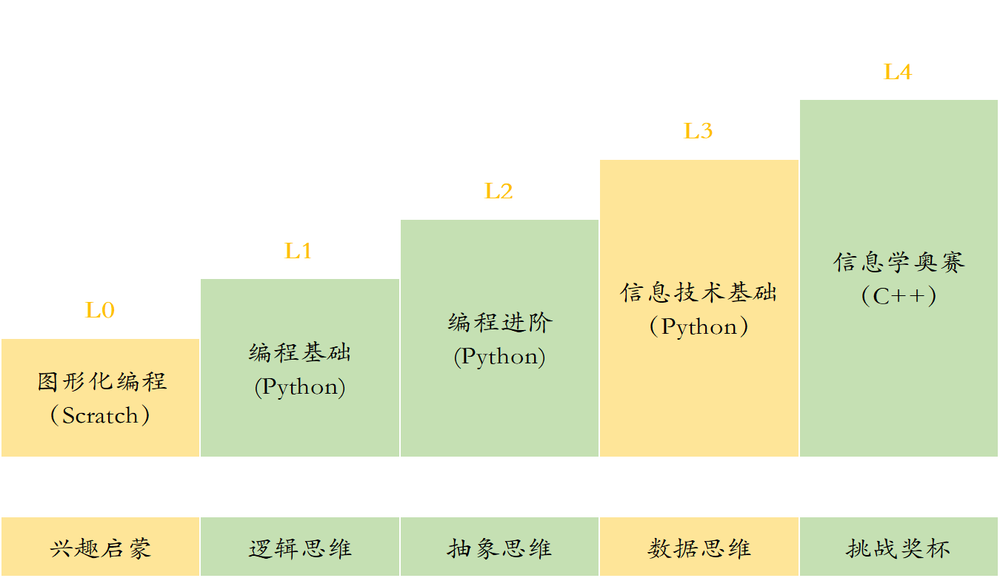
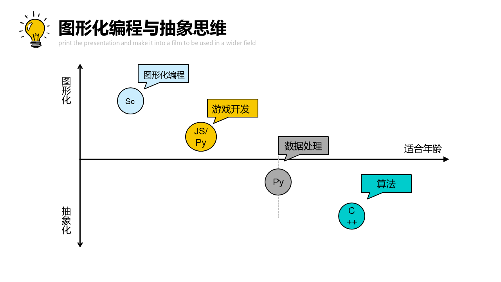
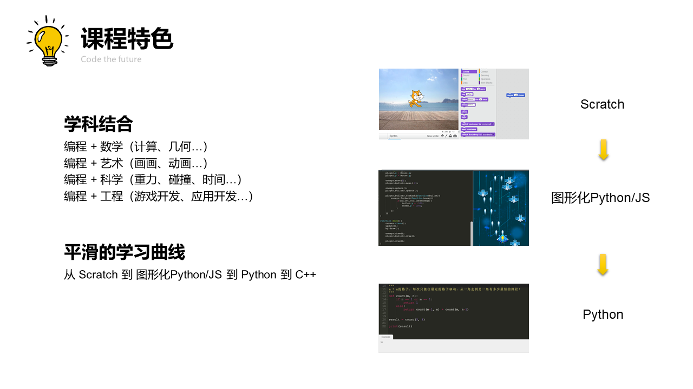

## 课程介绍

每个人都应该学习编程，因为它教会你思考。—— 乔布斯

### 对话未来 Code the Future

编程， 是孩子对话未来的语言 。如果说英语促进了世界范围内的交流，那么编程语言，在现在和未来，都将是世界上最通用的语言。

### 编程的重要性

#### 各个国家逐渐重视编程教育

目前，全球已有 24 个国家在基础教育中设立了编程课程大纲 ，其中大部分是发达国家。

* 美国：K12 阶段普及率高达67.5% 超过1200万学生在学习编程 
* 英国：5岁开始就要学习编程 11岁必须具备电脑双语 
* 中国：国务院《发展规划》指出： 要在中小学阶段逐步推广编程教育 
* 新加坡：2016年，新加坡政府对外宣布，在未来二十年内，要把新加坡变成智慧国——Smart Nation
* 韩国：教育部决定，将从2018年起将编程纳入小学正规必修课程
* ...

#### 编程——重点中学、名牌大学的强力敲门砖

现在除了浙江将编程纳入高考科目外，包括北京、南京、广州等城市也陆续将编程列入中考特招项目。 
不仅如此，信息学奥赛（NOIP）的学员也成为名牌大学青睐的对象。

2018年高校自主招生对信息学竞赛奖项要求统计（部分） 

| 奖项       | 学校                                         |
| ---------- | -------------------------------------------- |
| NOI获奖    | 清华、北大                                   |
| NOI获奖    | 中国人民大学、华中科技大学、中国科学技术大学 |
| NOIP一等奖 | 复旦大学、上海交通大学、南开大学、浙江大学   |
| NOIP二等奖 | 武汉大学、厦门大学、南京大学                 |
| NOIP三等奖 | 华东理工大学、西南交通大学、武汉理工大学     |

通过NOIP竞赛，许多孩子获得了名牌大学直接录取“降一本线录取”、“降分录取”等相关优惠政策。 

### 学习编程的好处

#### 引领时代的信息技术思维（计算思维）

苹果、Facebook、谷歌、阿里巴巴、腾讯、百度、京东，近十几年发展起来的大公司，无一不是与信息技术相关，他们的领军人物，几乎也都是很早就接触了编程，这让他们在孩子思维提升的黄金期 ，迅速的掌握了信息技术思维，才能在充满竞争的信息技术时代中脱颖而出。

* 比尔盖茨，微软创始人，13岁学编程
* 乔布斯，苹果的创始人，11岁学编程
* 扎克伯格，Facebook的创始人，10岁学编程

为什么要从小开始学编程

类似于运动员，如果不是从小就开始锻炼，那么几乎就没有成为顶尖运动员的机会。孩子在黄金期获得的思维训练将在一生中发挥巨大的作用。

#### 信息技术应用

中国新“四大发明”中的扫描支付、共享单车、网购无一不是建立在信息技术之上。各类游戏、视频、新闻、音乐也已经由传统方式转移到了网络之上，这一切的基础都是信息技术。

信息技术代表了先进的生产力，不管是现在，还是未来，朝气蓬勃的行业一定和信息技术息息关系。越早学习编程，越容易跟上信息社会发展的脚步。

#### 提升逻辑思维与创造力

在思考分析问题和完成程序的过程中培养编程思维。

#### 培养解决问题的能力

基于PBL的教学模式，让孩子在探索问题过程中，增强解决问题的能力。

### 立乐课程介绍

立乐课程共分为5个阶段，满足6~18岁学员的不同需求。不同阶段的学员都可以选择最合适自身的课程开始学习。

#### 兴趣启蒙阶段

针对6-8岁的少儿，最重要的是让他们对编程产生兴趣，正确引导少儿对计算机的认识。

#### 第一阶段：抽象思维

这个阶段的少儿正是开始产生抽象思维的时候，通过强化

#### 第二阶段：逻辑思维

对判断

#### 第三阶段：数据思维

#### 第四阶段：挑战奖杯

部分优秀的学生可以通过参加NOIP课程，挑战奖杯，获取顶尖学府自主招生的资格。

| 等级 | 阶段      | 工具    | 编码 | 展示 | 项目类型         | 目标     |
| ---- | --------- | ------- | ---- | ---- | ---------------- | -------- |
| L0   | 1-2年级   | Scratch | 图形 | 图形 | 动画、游戏       | 兴趣启蒙 |
| L1   | 3-4年级   | Python  | 文字 | 图形 | 动画、游戏、工具 | 抽象思维 |
| L2   | 5-6年级   | Python  | 文字 | 图形 | 动画、游戏、计算 | 逻辑思维 |
| L3   | 7年级以上 | Python  | 文字 | 文字 | 工具、计算、分析 | 数据思维 |
| L4   | 7年级以上 | C++     | 文字 | 文字 | 算法、数据结构   | 挑战奖杯 |

### 课程特色

#### 覆盖全年龄阶段的体系化课程

满足6-18岁青少儿学习编程的需要，针对不同阶段的学员采用不同的教学内容，以符合学员当前的认知水平。

#### PBL式教学

通过PBL的教学方式，寓教于乐，打造适合孩子的轻松课堂，不再刻板枯燥，让孩子爱上编程。 

#### 多学科结合

通过和多个学科进行结合，在学习编程的同时掌握数学、艺术、物理等学科知识。

#### 完善的教师培训体系

严格的培训和考核，对每位教师进行严格的能力考核、培训辅导和综合评价。 

### 立乐编程课程开发依据的标准

参考美国CSTA标准研发，教学实践双重验证，开发出适合中国青少年的编程课程体系，让孩子领跑未来。 

#### CSTA课程标准

我们的课程依据CSTA课程标准制定，课程内容与世界标准接轨。

CSTA，即计算机科学教师协会，由美国计算机协会(ACM)于2004年成立，发展到现在，成员数量已经超过25000名。而且成员构成非常多元化，不仅涵盖了K-12各个阶段（小学、初中、高中）CS 学科的一线教师，还包括大学教师、工业界及政府成员，其他非盈利组织成员，学生父母等。这些成员来自于145个国家。

CSTA 的合作伙伴包括 ACM 和政府基金，谷歌、微软、甲骨文等高科技公司，code.org 等机构， 协会的使命是为全球计算机科学教师赋能，促进计算机科学教育的发展。

#### 教学实践

立乐拥有超过100名经验丰富的编程教师，和线下20多所中小学学校进行过合作，已经为超过5000名来自世界各地的学员提供了编程教学服务。

合作院校

- 上海虹桥国际学校
- 上海赫德国际学校
- ...

