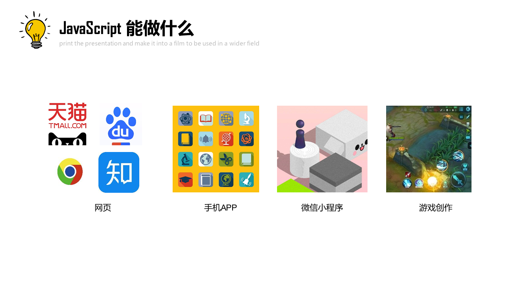

## JavaScript是什么

JavaScript是世界上最流行的脚本语言，因为你在电脑、手机、平板上浏览的所有的网页，以及无数基于HTML5的手机App，交互逻辑都是由JavaScript驱动的。

简单地说，JavaScript是一种运行在浏览器中的解释型的编程语言。

在Web世界里，只有JavaScript能跨平台、跨浏览器驱动网页，与用户交互。

### JavaScript的应用

### 特点

JavaScript脚本语言具有以下特点:

(1)脚本语言。JavaScript是一种解释型的脚本语言,C、C++等语言先编译后执行,而JavaScript是在程序的运行过程中逐行进行解释。

(2)基于对象。JavaScript是一种基于对象的脚本语言,它不仅可以创建对象,也能使用现有的对象。

(3)简单。JavaScript语言中采用的是弱类型的变量类型,对使用的数据类型未做出严格的要求,是基于Java基本语句和控制的脚本语言,其设计简单紧凑。

(4)动态性。JavaScript是一种采用事件驱动的脚本语言,它不需要经过Web服务器就可以对用户的输入做出响应。在访问一个网页时,鼠标在网页中进行鼠标点击或上下移、窗口移动等操作JavaScript都可直接对这些事件给出相应的响应。

(5)跨平台性。JavaScript脚本语言不依赖于操作系统,仅需要浏览器的支持。因此一个JavaScript脚本在编写后可以带到任意机器上使用,前提上机器上的浏览器支 持JavaScript脚本语言,目前JavaScript已被大多数的浏览器所支持。 

