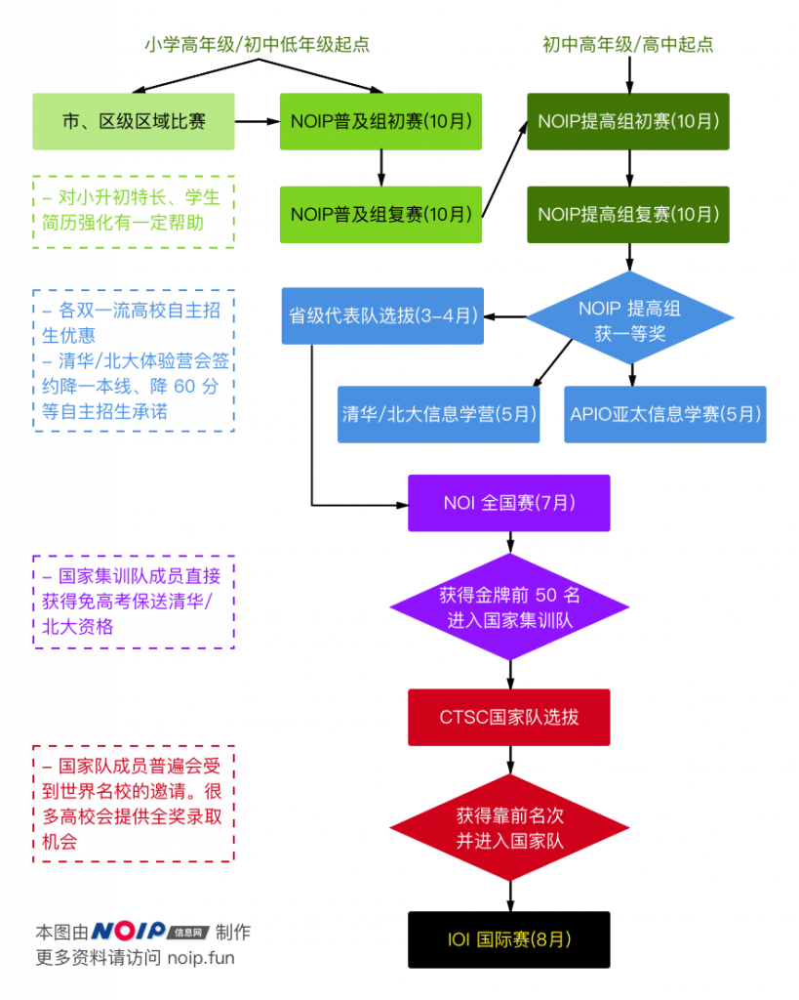

## 关于信息学奥赛

信息学（Informatics）一词在很多场合是计算机科学（Computer Science）的代称。在中国大陆地区，特别是中学阶段主要指计算机科学中关注“计算机理论与算法（Theory and Algorithms）”的子领域。

在社会各领域被信息技术快速变革和推动的背景下，针对各年龄段的“信息学竞赛”、“算法竞赛”应运而生，这些竞赛为我国信息技术的发展和人才培养做出了卓越的贡献，为清华大学、MIT等学校提供了优秀的本科生、研究生生源。搜狗CEO王小川、人工智能时代中国领军人物戴文渊、楼天城、唐文斌等都曾在求学阶段参与信息学竞赛。

信息学竞赛分为三个主要学习阶段

### 第一阶段：小学/初中低年级阶段

竞赛语言：C++（C、BASIC、PASCAL正在陆续被取消中）

##### A. 省/市/区级竞赛：

由有条件的省、市、区组织的面向小学和中学的区域性竞赛。根据各地情况，相关竞赛成绩在小升初简历中体现对小升初有一定帮助。

组织单位：地方科协或科协授权单位

赛事难度：低

考察内容：根据各地差异略有不同。小学阶段主要覆盖基础程序设计内容，初中阶段在基础程序设计的基础上增加了枚举、简单搜索、二分、字符串处理等内容。

##### B. NOIP 普及组：

以省为单位组织的全国性竞赛，主要面向初中生，也有部分小学生参加。在初中升高中阶段，各地重点高中普遍有信息学特长生计划，相关成绩对学生升入重点高中有较大帮助。

组织单位：中国计算机学会及各省特派员

赛事难度：中等

考察内容：在程序设计的基础上，还包括了枚举、简单动态规划、简单的数据结构、搜索算法、基础的图和树上的算法、最短路算法等。

### 第二阶段：初中高年级/高中阶段

竞赛语言：C++（C、PASCAL正在陆续被取消中）

以省为单位组织的全国性竞赛，第一阶段为省内排名的联赛，优秀者可进入第二阶段的国家级竞赛。主要面向高中生，也有部分初中生、小学生参加。在这一赛事中获得奖项对于全国高校自主招生有巨大帮助，如进一步进入到国家级赛事并进入国家集训队，将提前获得保送进入清华、北大的入场券，还有部分学生甚至会收到来自美国高校的全额奖学金录取邀请。

组织单位：中国计算机学会及各省特派员

赛事难度：高

考察内容：省级联赛阶段在程序设计的基础上，还包括了动态规划、数据结构、搜索、图论、字符串算法、组合数学、数论等。国家级赛事出现的题目类型则更多，还复杂的图论网络流算法、后缀数组、随机算法等内容。

备注：NOI 中高分选手还将参加中国国家队选拔赛（CTSC），优胜选手将组成国家队代表中国出战国际信息学奥林匹克竞赛（IOI），获得来自全球各地各个名校、名师伸出的“橄榄枝”。

### 第三阶段：大学阶段

竞赛语言：C++、C、Java

##### A. ACM 国际大学生程序设计竞赛（ACM-ICPC 竞赛）：

一项旨在展示大学生创新能力、团队精神和在压力下编写程序、分析和解决问题能力的年度竞赛，也是唯一。经过近 40 年的发展，ACM 国际大学生程序设计竞赛已经发展成为全球最具影响力的大学生程序设计竞赛。赛事由各大洲区域预赛和全球总决赛两个阶段组成，当前中国地区的预赛属于亚洲东大陆地区。

该竞赛是唯一入选中国高校创新人才培养暨学科竞赛评估的程序设计竞赛。对进入名企就业、一流高校保研、出国读研申请的帮助都是巨大的。

组织单位：国际计算机学会（Association for Computing Machinery）

赛事难度：中等

考察内容：在程序设计的基础上，还考察了数据结构、基础图论、数论、搜索、动态规划、网络流、字符串算法、后缀数组、组合数学等知识。

##### B. 全国软件和信息技术专业人才大赛：

该比赛又称“蓝桥杯（声明：该名称为国信蓝桥教育科技（北京）股份有限公司商标，本站在此提及并不用于任何商业目的）”。分为 A、B、C 三个难度组别，一本院校（985、211）本科生只能报大学A组。所有院校研究生只能报大学A组。在该比赛 A 组获得二等奖以上的成绩对于学生就业有一定帮助，对部分一般高校保研、奖学金有一定作用。

组织单位：中华人民共和国工业和信息化部人才交流中心名义主办，由国信蓝桥教育科技（北京）股份有限公司实际组织

赛事难度：低~中等

考察内容：

A组：在程序设计的基础考察上，增加了枚举、简单搜索、二分、字符串处理等内容的考核。

B组：在程序设计的基础考察上，还考察了一些简单数据结构知识；

C组：程序设计语言基础语法和语言特性。