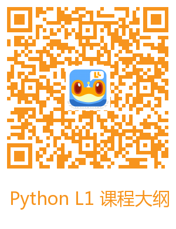

## Python（L1）课程介绍

### 适用对象

（1）8~12岁正常学力儿童

（2）无编程基础，对电脑有简单了解的学生

### 课程介绍

**本课程分为8个单元，每单元6个课时，共48课时。**

在完成本课程的学习后，学生应掌握下列知识：

（1）     理解编程的概念，了解python语言的重要性与应用范围

（2）     掌握基本的代码规范，学会正确规范地编写代码

（3）     掌握python基本语法，学会正确使用python语言

（4）     理解坐标系的概念，掌握坐标系的用法

（5）     掌握基本图形的属性认识和绘制函数

（6）     理解对象与类的概念，掌握常用图形对象和多媒体对象的属性和方法

（7）     理解变量和函数的概念，学会正确地定义和使用变量和函数

（8）     理解条件逻辑，学会使用条件逻辑分析问题，能够使用if条件语句实现条件逻辑

（9）     理解事件的概念，理解事件的基本逻辑关系，学会在代码中正确应用各种事件代码，例如：点击事件、键盘事件、碰撞事件等

### Unit 1 梦幻涂鸦

#### 课程内容

学习最基本的图形绘制函数和图片导入函数，用图形函数创作涂鸦艺术作品。

#### 单元目标

**知识与技能**

本单元主要学习基本的代码编写，代码运 行。其中主要学习了基本图形的绘制，例如： circle 绘制函数、rectangle   绘制函数、line 绘 制函数和多媒体图片导入的基本用法。

**过程与方法**

本单元通过在老师指导下完成项目，培养 学生对编程学习的基本认识以及基本代 码编写习惯。锻炼学生的计算机操作能 力。JS 编程语言的入门学习，学会应用简   单的编程知识与代码。

**情感态度与价值观**

  本单元通过老师的指导及鼓励，学生自主 完成项目，增强学生的自信心，以及对编 程学习的热情。建立学生的编程自信。

