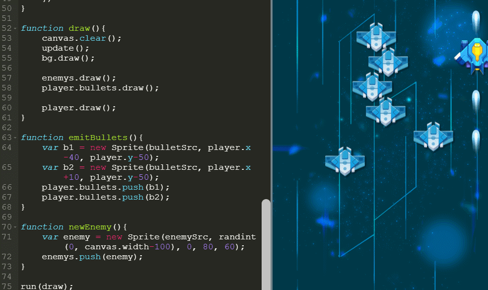

## 为什么要学Python

提高学习编程，许多人第一反应就是 “难”。的确，编程作为一个和计算机交流的语言，语法非常严谨，任何一个小错误都可能导致程序运行出错，因此，在教学时一般采用自下而上的方式，先花费大量的时间讲述基本概念，然后是大量而冗长的练习。在这之后，才开始接触一些编程的应用，从而，真正能体会到编程乐趣的人少之又少，大部分学生都在学习过程中降低了对编程的兴趣，视“编程”为猛虎，从此不敢再碰编程一下。

针对这种情况，我们开发了这一系列的图形编程课程。课程以自上而下的方式，先体验编程乐趣，再讲解编程知识，不再拘泥于讨论语法细节，而在于使用编程来开发项目，在项目开发中不断的去应用编程语法知识。我们认为，应用->反馈->学习的途径，是学习编程并保持对编程兴趣的最好方式。

### 做游戏，学编程。

俗话说，兴趣是最好的老师。本书利用最少的语法知识，进行游戏的开发。再把游戏开发应用于Python语言教学。从无到有开发游戏，通过游戏案例逐步应用语法知识，提升对编程的兴趣和能力 。

**例子：做游戏，学编程**

### 为什么选择Python

### 和Scratch对比

Scratch是MIT开发的一门面向儿童的图形化编程语言，适合于一二年级的小朋友。作为入门编程语言，Scratch简化了许多编程概念，不再需要小朋友输入文本，也几乎不会有语法错误发生，积木块式的编程语言不需要太多的学习就可以创作错许多动画和游戏。

#### 孩子学编程一定要从可视化图形化编程开始吗？

​      我们认为，从图形化编程（Scratch）开始学起不是不可以，但应该尽早转到代码阶段，当然直接跳过Scratch这个阶段也是可以的。

#### Scratch的局限是什么？

​      首先，Scratch出口具有局限性，比赛少并且含金量较低，对升学考试帮助不大。

​      其次，Scratch无法实现复杂程序，编程最终还是要回归代码，所以尽早让孩子从图形化编程过渡到代码是很关键的。

​      其实，编程语言也是一种语言，它也有词汇、语义和语法。语言是编程的一个重要部分，在描述一些复杂逻辑时，编程语言能够比图形具有更强的描述力，特别是对数据结构的描述，以及对于类和对象的描述。

​      直接用编程语言编程，孩子必须得注意词汇和语法的正确性，以及在适当的地方加空格和换行。这些东西在图形化编程工具里面是不会遇到的，这也是孩子必须得到训练的能力之一。

​       引用著名计算机科学家、技术作家Paul Graham的一个观点：“编程语言是用来思考程序的，而不是用来表达一个你已经想好的程序的。”这句话的意思是说，编程语言是思考的工具，而不是一种单纯的表达形式，你不能指望用中文（或者英文）在脑子里思考一个程序，然后用编程语言把它表达出来。

​     所以，就跟学英语要趁早一样，编程语言也需要尽早让孩子接触。

### 编程学习过程

| 等级 | 阶段      | 工具    | 编码 | 展示 | 项目类型         | 目标     |
| ---- | --------- | ------- | ---- | ---- | ---------------- | -------- |
| L0   | 1-2年级   | Scratch | 图形 | 图形 | 动画、游戏       | 兴趣启蒙 |
| L1   | 3-4年级   | Python  | 文字 | 图形 | 动画、游戏、工具 | 抽象思维 |
| L2   | 5-6年级   | Python  | 文字 | 图形 | 动画、游戏、计算 | 逻辑思维 |
| L3   | 7年级以上 | Python  | 文字 | 文字 | 工具、计算、分析 | 数据思维 |
| L4   | 7年级以上 | C++     | 文字 | 文字 | 算法、数据结构   | 挑战奖杯 |

### 本课程适用人群

编程零基础，想要学习编程，对游戏开发感兴趣的同学。