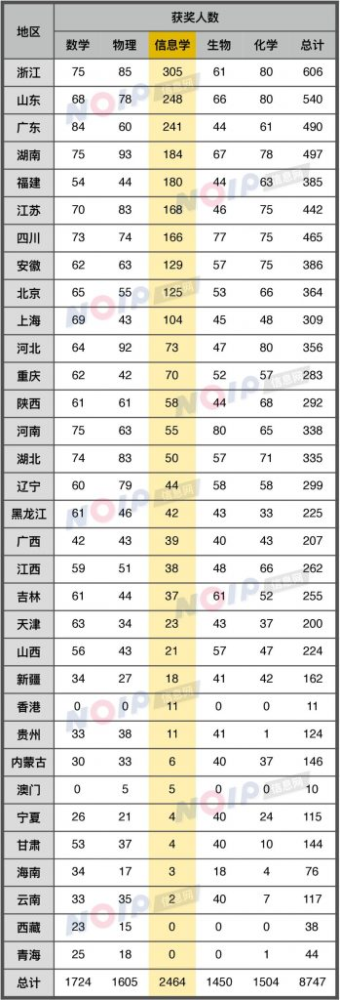
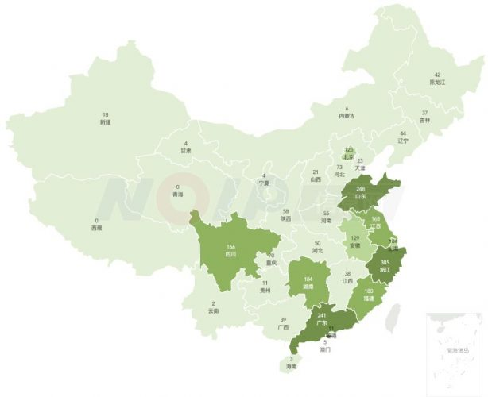

## 五大学科奥赛统计发布 信息学成学科竞赛最优选择

信息学奥赛作为与数学、物理、化学、生物并列的国际五大奥林匹克竞赛项目、唯一的工科奥林匹克竞赛项目，已经成为小升初、中考特长生招生，高考大学自主招生，以及出国留学背景提升的一项重要申请条件。

近期，中国科协公示了 2017 年数学、物理、信息学、化学、生物五大学科奥林匹克竞赛省级赛区一等奖获奖名单。

据统计，五大奥林匹克竞赛一等奖总人数从 2016 年的 7595 人递增到了 2017 年的 8727 人，增长率达 14.9%。其中，信息学奥林匹克竞赛一等奖人数超过数学奥林匹克竞赛 740 人，在占比上超过数学奥林匹克竞赛 8%。

总得来看，信息学在东南沿海省份的普及程度显著要高一些，在四川、湖南、北京等地也有较好的普及度。在浙江、广东、福建、山东，学科奥林匹克竞赛省级一等奖中，信息学奥林匹克竞赛获奖者已经占据了半壁江山。

在浙江、江苏、安徽、吉林、福建，信息学已经成为了在当地贡献学科顶尖人才最多的竞赛项目。

与全国数百万学习“奥数”的中小学生相比，参加信息学奥林匹克竞赛的学生不到 8 万，形成强烈的反差。在总获奖人数上却是数学的 1.4 倍，由于参赛人数上差异大，信息学竞赛在部分省份获奖率超数学联赛的十数倍。 