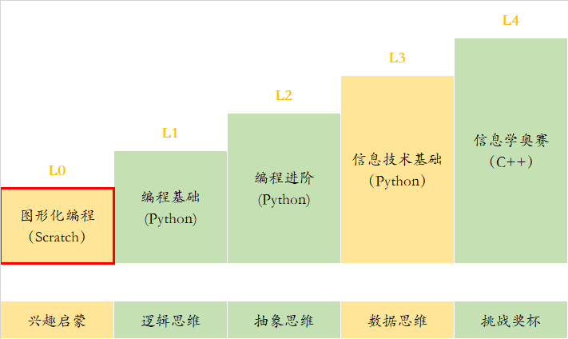

# Scratch（L0）课程介绍

### 课程定位

### 适用对象

（1）5~8岁学员（幼儿园到二年级）

（2）无编程基础，平时电脑接触比较少的小朋友

### 课程介绍

**本课程分为4个单元，每单元6个课时，共24课时。**

在完成本课程的学习后，学生应掌握下列知识：

（1）     理解编程的概念，了解scratch图形化软件的使用，和积木的基本操作与用法

（2）     掌握基本的积木应用，学习简单的思维逻辑与相对应的积木。

（3）     掌握与编程有关的数学和计算机知识，学习较难的思维逻辑与相对应的积木

理解对象与对象之间的关系，让对象之间传可以递消息或变量内容。

### Scratch课程大纲

扫码查看课程大纲

