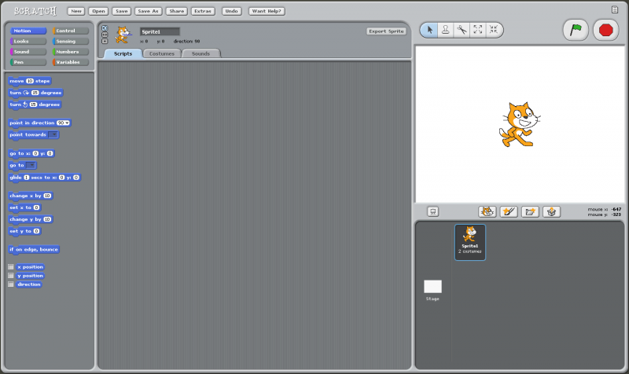
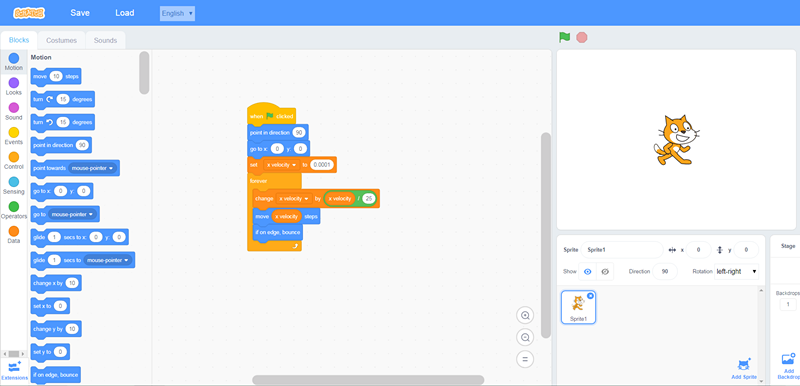
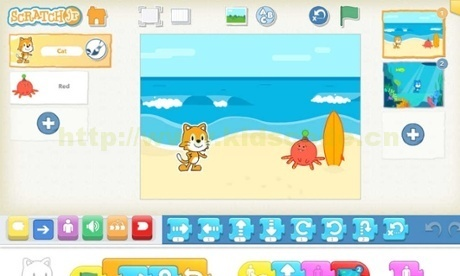

## Scratch是什么

### Scratch编程语言

Scratch，是一款由麻省理工学院(MIT) 设计开发的面向少年的简易编程工具。它是一款可视化积木拼搭的编程软件，它提供了图形化的编程环境。作为儿童图形化编辑软件，学生不仅能通过Scratch这个学习工具，掌握基本的编程概念，提高思维能力，还可以更好地去理解和掌握各个学科的知识，例如英语、数学、逻辑思维、工程管理等课程，对于孩子的各方面发展都有很大的提高。 

### 什么年龄段的孩子适合学Scratch

6~8岁的儿童

#### 完全图形化

完全图形化界面，内置了很多角色和背景，孩子学完基本的命令之后就可以快速开发出一个好玩的小游戏，特别有成就感，很适合初期培养兴趣。

#### 无需太多的键盘

几乎可以全部用鼠标或者触屏操作，基本不需要键盘，对于不会打字的孩子很友好。

#### 中文支持

有中文版，中文版里面那些命令也是中文的，对于不太懂英文的孩子很友好。

#### 扩展性好

具有充分的扩展性，可以控制一些外部设备（比如单片机、乐高机器人），也被移植到很多嵌入式设备上，实现一些基本的功能。

### Scratch的版本

Scratch发布了1.0、2.0版本，3.0版本正在测试中，其中1.0版本已经不再更新，目前大多数情况下使用的都是2.0版本。

#### Scratch 1.0

Scratch早期发布的版本，目前已经不再使用。

#### Scratch 2.0 

本课程采用的Scratch版本，也是目前学校和机构主要使用的版本。

#### Scratch 3.0

1. 采用Html5的页面技术，支持横式和直式的图形式程序撰写，未来可以在iOS&Android手机平板机及桌上电脑跨平台的使用。
2. 声音引擎（Audio Engine）会重新设计，程序画面的速度因为WebGL的加速，达到40 fps，比Scratch 2.0的30fps快了一些，支持16:9画面，未来课程中做出的小游戏应该会更好玩和更加流畅。
3. 一个非常大上的差异：每一个方块都比文字大很多，好处是让手指头好触碰，可是程序指令写多一些时，就会让画面放不下所有的程序，需要卷动（scroll）程序区，然而卷动却是在教学现场学生时做的非常不好的事。
4. 增加类似于AppInventor的模块折叠功能,还有垃圾桶功能。

#### Scratch JR

MIT的ScratchJr是Scratch编程语言中的一款专门为学前儿童开发的iPad应用,目前也有android应用,适合5-7岁孩子学习编程。

